# moviepicker

## 0. 프로젝트 개요

- 프로젝트명 : 무비피커(moviepicker)
- 프로젝트 컨셉 : '인생영화'를 주제로 SNS 기반의 영화 커뮤니티 사이트
- 개발 기간 : 22.11.16 ~ 22.11.24 (9일)

- 팀원 : 유선준, 이은지
- 사용 기술스택 : Django, Vue.js, JavaScript, SCSS


## 1. 팀원 정보 및 업무 분담 내역

| 이름   | 역할           | 설명                                          |
| ------ | -------------- | --------------------------------------------- |
| 유선준 | Back-end 전반  | 데이터베이스 설계 및 구축, 추천 알고리즘 구현 |
| 이은지 | Front-end 전반 | UI 디자인, Vue를 활용한 SPA 구현            |


## 2. UI 디자인 및 프로토타입

피그마를 활용하여 최종 구현 화면과 동일하게 디자인하여 프로토타입을 제작했습니다. (아래 이미지는 실제로 구현한 화면이 아닌 피그마로 구현한 이미지입니다.)

### 1) Login, Signup

로그인 및 회원가입 페이지입니다.

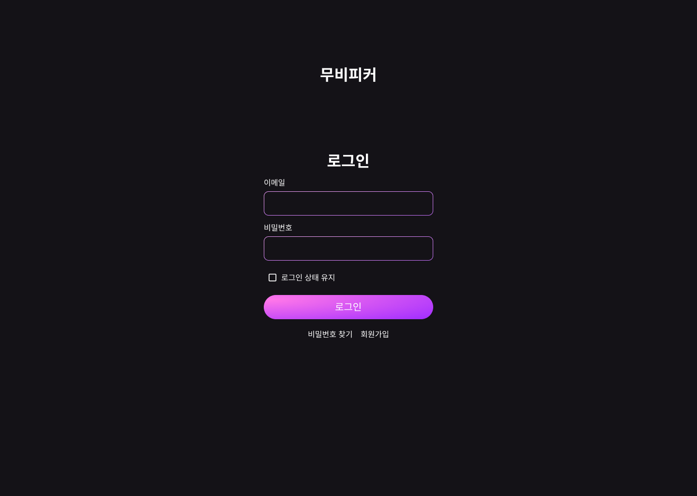

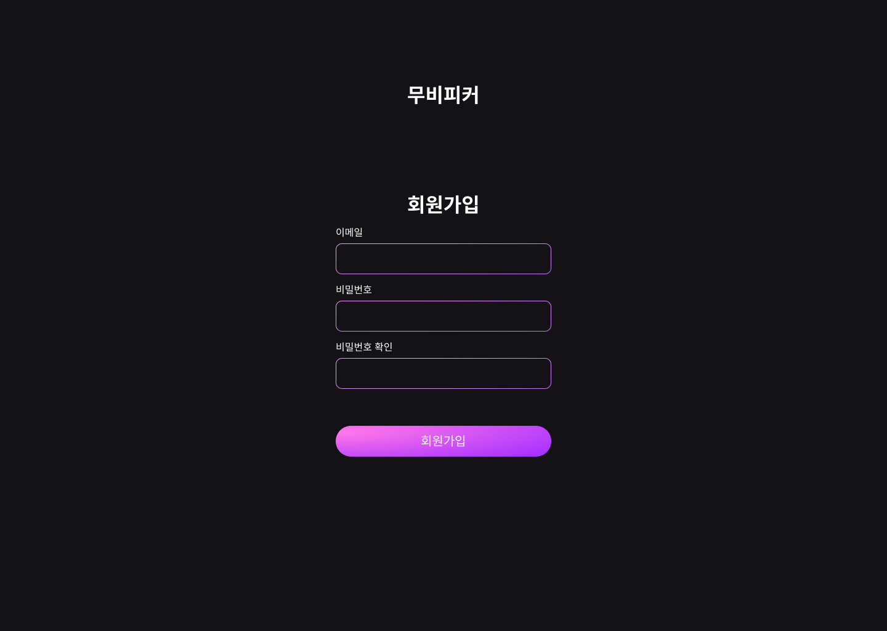


### 2) FirstAddMovie

최초 회원가입시 입장하게 되는 '봤어요' 및 '보고싶어요' 영화 추가 페이지입니다.

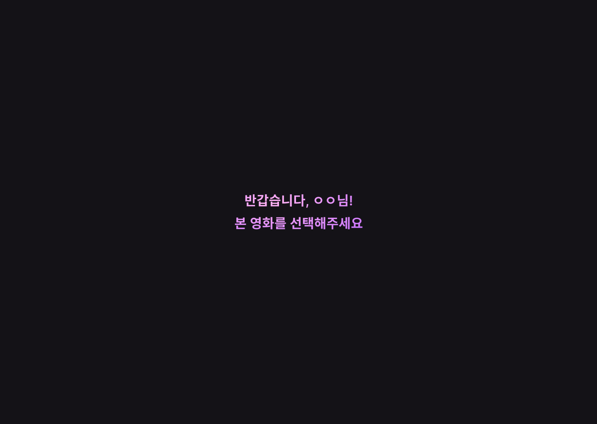

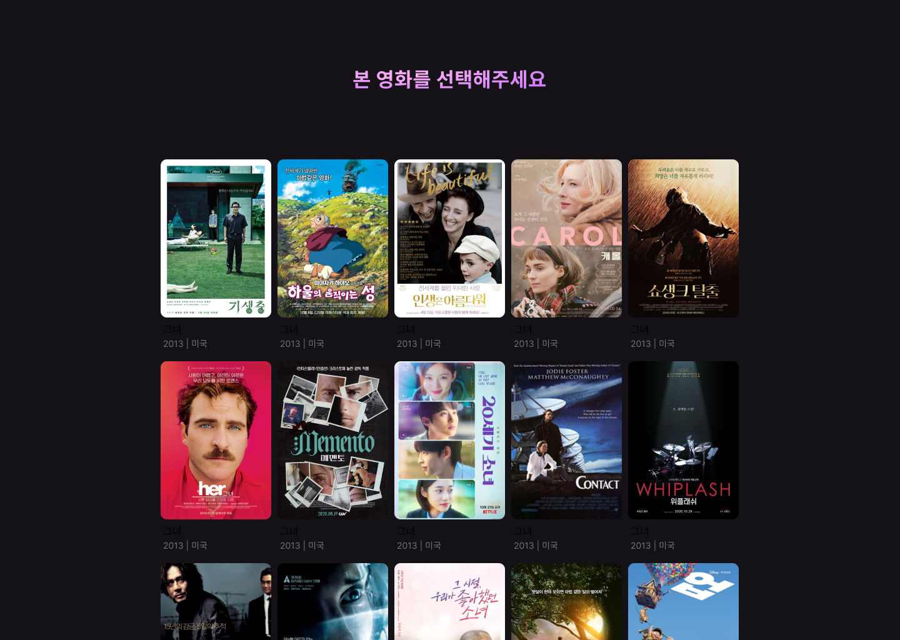


### 3) index

로그인시 처음으로 마주하게 되는 홈 화면입니다.

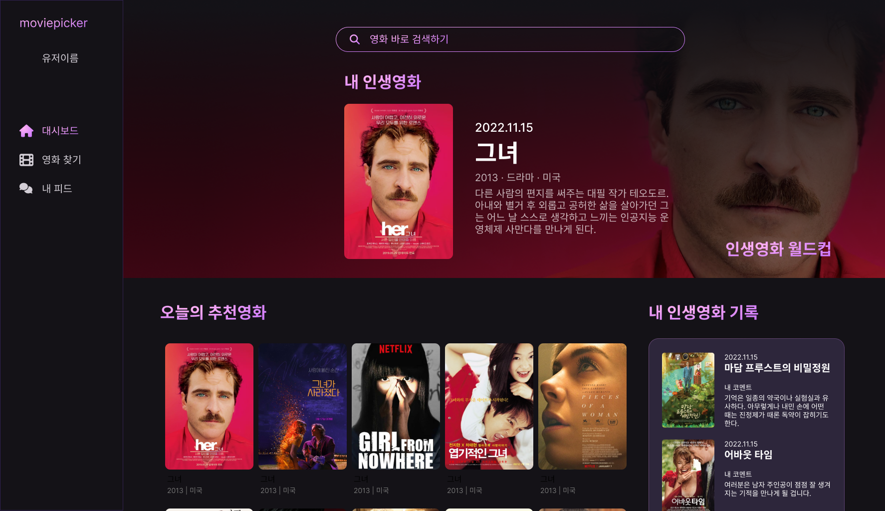


### 4) MovieDetail

영화 포스터를 클릭하면 이동하게 되는 해당 영화의 디테일 페이지입니다.


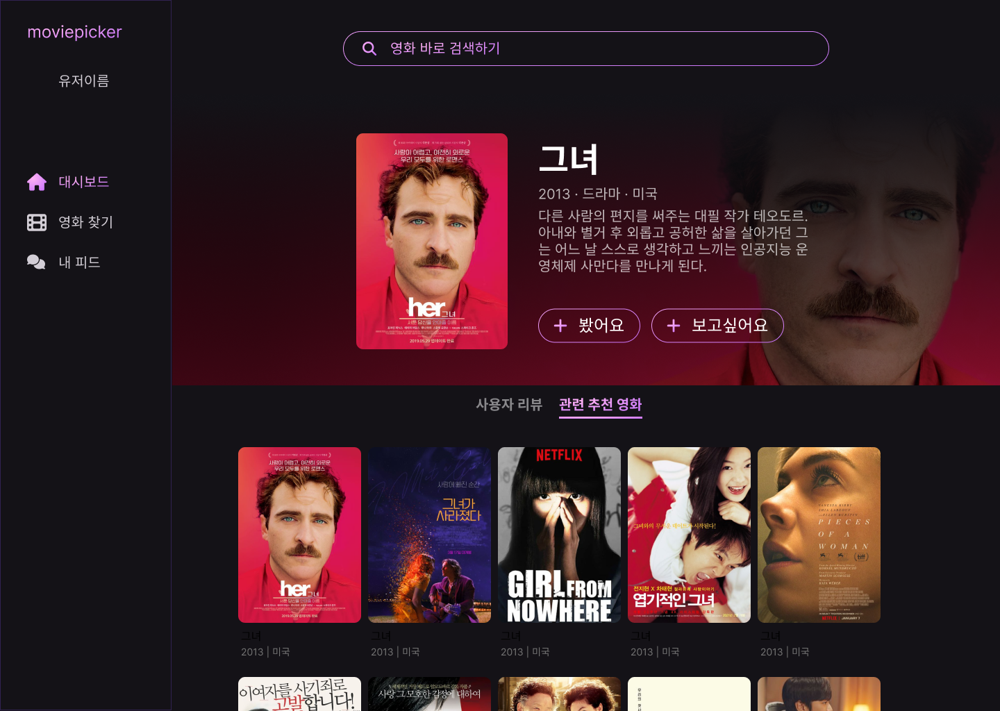


### 5) MovieSearch

영화를 검색하는 페이지입니다.

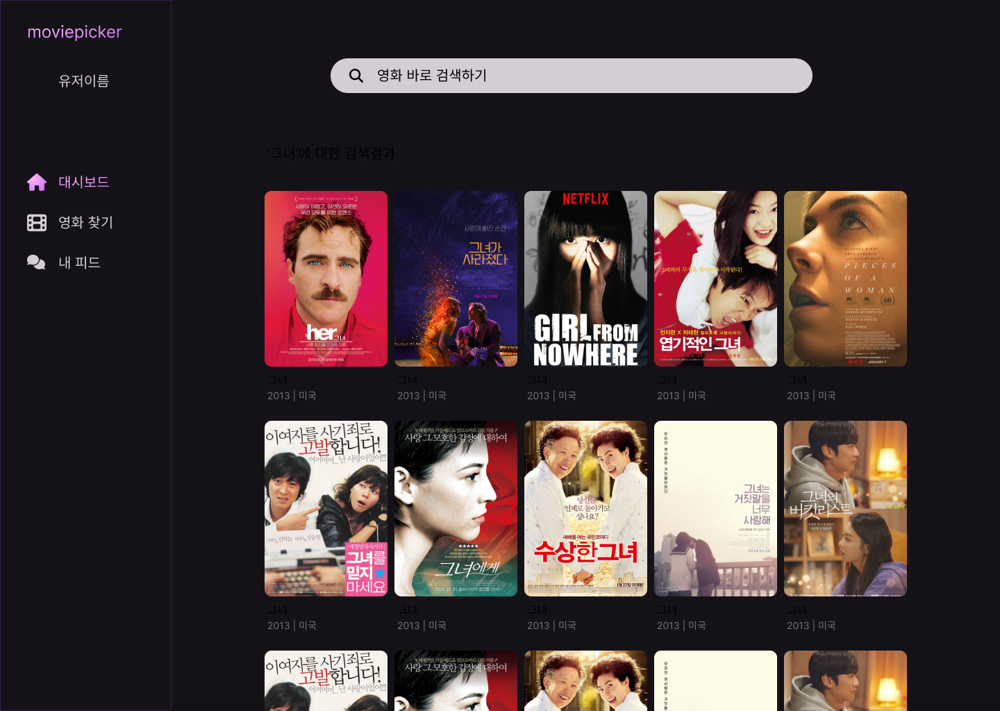


### 6) Feed

내가 팔로우하고 있는 유저들의 인생영화 업데이트 기록을 볼 수 있는 페이지입니다.

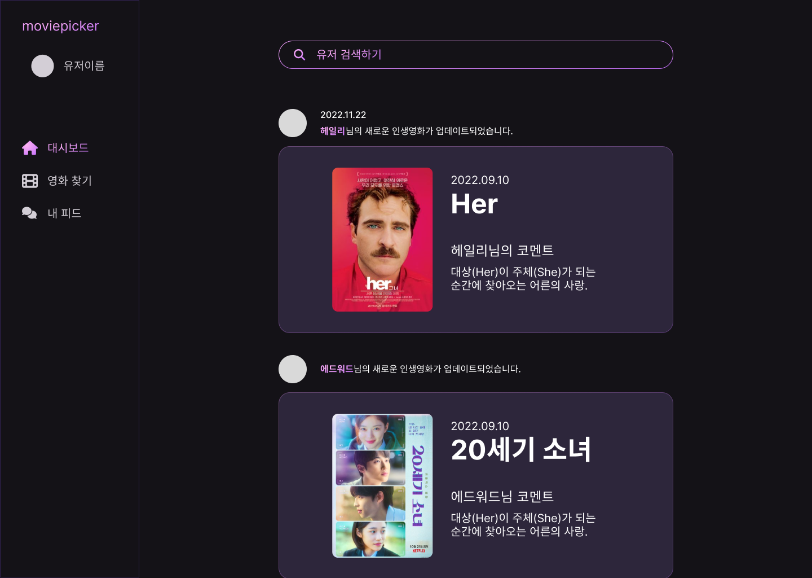


### 7) UserSearch

유저에 대한 검색 결과를 보여주는 화면입니다.

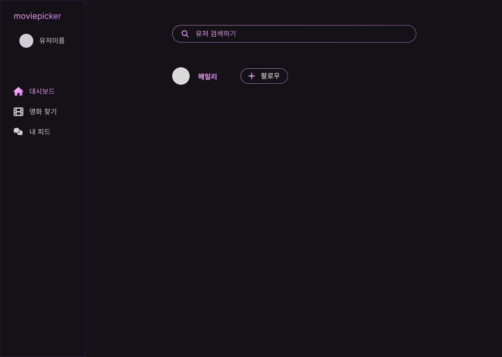


### 8) UserDetail

유저의 프로필 사진을 클릭하면 이동하게 되는 유저 디테일 페이지입니다.

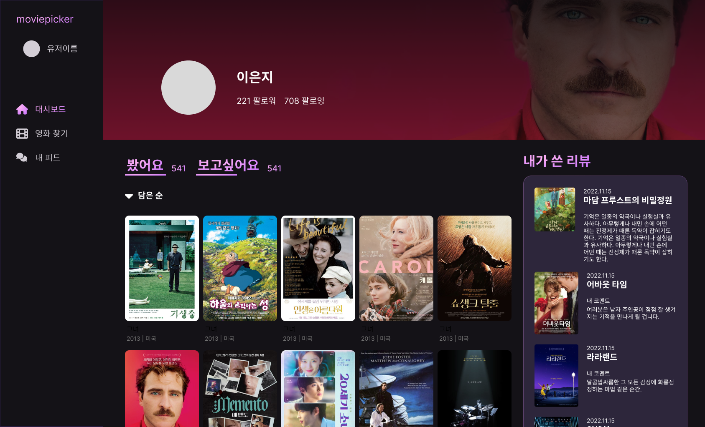


### 9) Game

인생영화 월드컵을 진행하는 화면입니다.

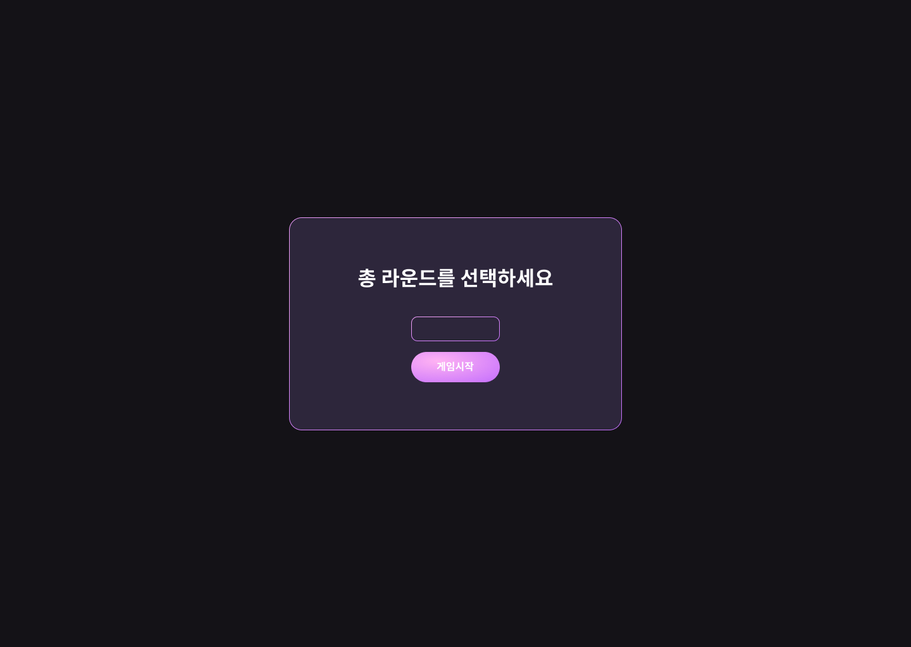

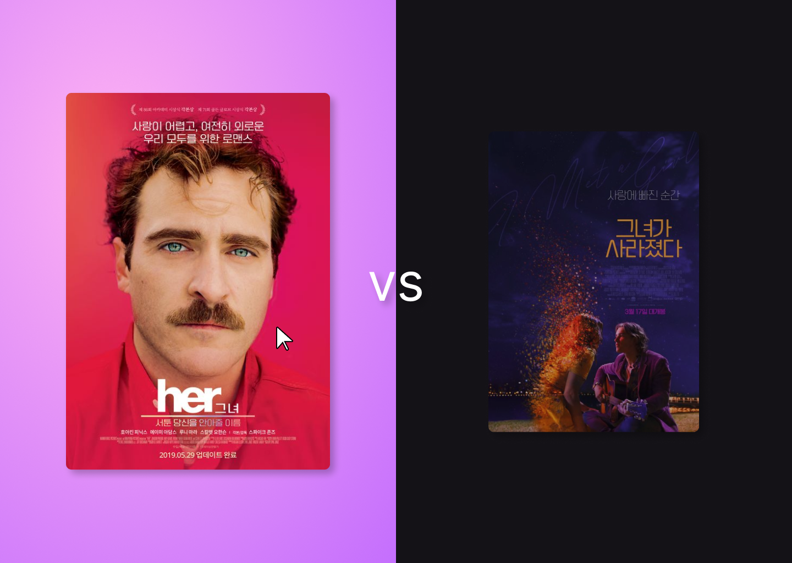

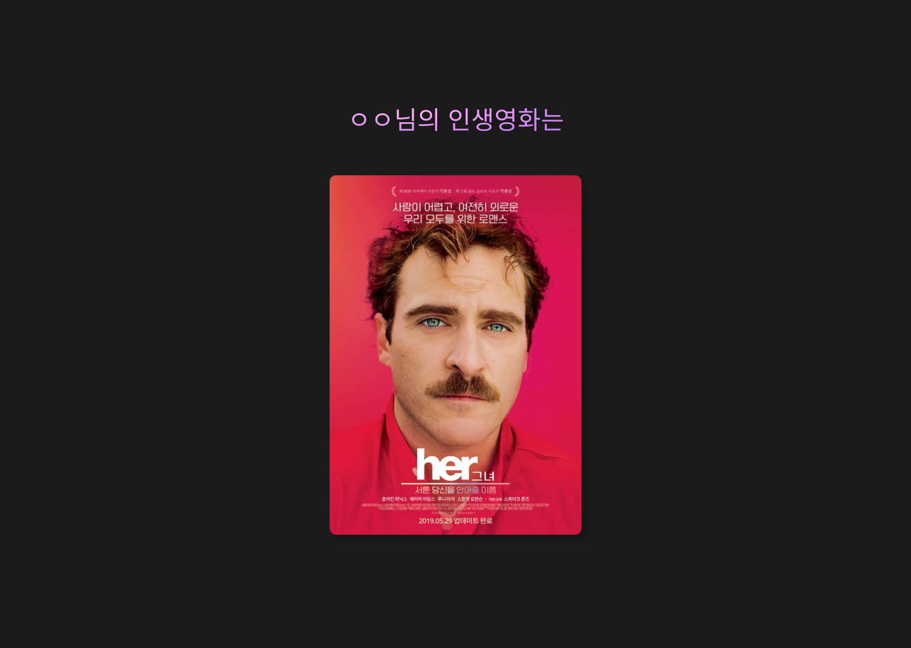


## 3. 목표 서비스 구현 및 실제 구현 정도

2에 해당하는 화면 및 세부 기능 모두 구현 완료


## 4. 데이터베이스 모델링 (ERD)

### ERD


### DB 구성

Database(DB)는 pjt 초기에 TMDB API를 이용해 데이터를 받아와 서비스 제공에 필요한 모든 데이터를 DB화 하여 프론트(Vue) - 백(DRF) 외에는 외부로의 추가적인 API요청이 없도록 구성하였습니다.

#### 장르 데이터 구성
```python
def get_genre_data():
    genre_data = []

    request_url = f'https://api.themoviedb.org/3/genre/movie/list?api_key={TMDB_API_KEY}&language=ko-kr'
    genres = requests.get(request_url).json()
    for genre in genres['genres']:
        fields = {
            'name': genre['name']
        }
        data = {
            'pk': genre['id'],
            'model': 'movies.genre',
            'fields': fields
        }
        genre_data.append(data)

    with open('genre_data.json', 'w', encoding="utf-8") as make_file:
        json.dump(genre_data, make_file, ensure_ascii=False, indent="\t")
```

#### 국가 데이터 구성
```python
country_dict = {
    'KR': 1,
    'US': 2,
    'GB': 3,
    'FR': 4,
    'CN': 5,
    'JP': 6,
    'IN': 7,
    'HK': 8,
    'TW': 9,
    'NO': 10,
    'PE': 11,
    'ES': 12,
    'DE': 13,
    'IT': 14,
    'RU': 15,
    'AU': 16,
}
```

국가 데이터 같은 경우에는 TMDB API문서를 참고하여 서비스 제공에 필요한 일부 국가만 국가 명으로 별도로 저장하고, 그 외는 기타로 처리하여 JSON 파일을 직접 구성했습니다.

#### 영화 데이터 추출
```python
def get_movie_data():
    movie_data = []

    for idx in range(1, 5):

        print(idx)

        request_url = f"https://api.themoviedb.org/3/movie/popular?api_key={TMDB_API_KEY}&language=ko-KR&page={idx}"
        movies = requests.get(request_url).json()

        for movie in movies['results']:

            if movie.get('release_date', '') and movie.get('overview', '') and movie.get('poster_path', ''):
                
                movie_id = movie['id']

                # 개별 영화 detail api
                detail_url = f'https://api.themoviedb.org/3/movie/{movie_id}?api_key={TMDB_API_KEY}&language=ko-KR'
                movie_detail = requests.get(detail_url).json()
                

                countries = []
                for country in movie_detail['production_countries']:
                    if country['iso_3166_1'] in country_dict.keys():
                        countries.append(country_dict[country['iso_3166_1']])
                    elif 17 not in countries:
                        countries.append(17)

                # 트레일러 api
                trailer_key = "" # django convention is to use an empty string
                video_url = f'https://api.themoviedb.org/3/movie/{movie_id}/videos?api_key={TMDB_API_KEY}&language=en-US'
                videos = requests.get(video_url).json()
                for video in reversed(videos['results']):
                    if video['type'] == 'Trailer' and video['site'] == 'YouTube':
                        trailer_key = video['key']
                        break

                # 추천 영화 api
                recommended = []
                recommendation_url = f'https://api.themoviedb.org/3/movie/{movie_id}/recommendations?api_key={TMDB_API_KEY}&language=ko-KR&page=1'
                recommended_movies = requests.get(recommendation_url).json()
                for recommended_movie in recommended_movies['results']:
                    if recommended_movie['id'] in movie_pk_list:
                        recommended.append(recommended_movie['id'])

                
                fields = {
                    # 'movie_id': movie['id'],
                    'title': movie['title'],
                    'original_title': movie['original_title'],
                    'released_date': movie['release_date'],
                    'popularity': movie['popularity'],
                    'vote_count': movie['vote_count'],
                    'vote_avg': movie['vote_average'],
                    'overview': movie['overview'],
                    'poster_path': movie['poster_path'],
                    'backdrop_path': movie['backdrop_path'],
                    'trailer_path': trailer_key,
                    'genres': movie['genre_ids'],
                    'countries': countries,
                    'recommended': recommended
                }

                data = {
                    'pk': movie['id'],
                    'model': 'movies.movie',
                    'fields': fields
                }

                movie_data.append(data)

    with open('new_movie_data_test.json', 'w', encoding="utf-8") as make_file:
        json.dump(movie_data, make_file, ensure_ascii=False, indent="\t")
```

영화 데이터 같은 경우에는 기본적으로 TMDB의 popular에 있는 영화 중 '개봉일', '개요', '포스터' 등의 정보가 있는 영화 데이터를 필터링한 뒤 각 영화마다 pk 값을 통해서 개별 영화 상세 정보에 대한 API요청을 통해 '국가' 등의 정보를 받아왔습니다.

```python
movie_pk_list = [5, 11, 12, 13, 14, 15, 16, 18, 19, 20, 22, 24, 25, 27, 28, 33,
35, 38, 55, 58, 59, 62, 63, 65, 68, 69, 70, 71, 73, 74, 75, 76, 77, 78, 79, 80,
81, 82, 83, 85, 87, 88, 89, 90, 93, 95, 96, 97, 98, 101, 103, 104, 105, 106,
107, 111, 113,
...
]
```

이후 각 영화마다 추천 영화 목록에 대한 API 요청을 보내서 추천 영화를 db화 하였는데 해당 과정에서 참조 무결성의 원칙을 고려하여 1차적으로 추출한 데이터에서 pk값만 추출한 해당 추천 영화가 기존 영화 목록의 pk list에 존재하는 경우만 db화 하였습니다.


결론적으로 위와 같은 과정을 통해 8254개의 영화로 db를 모델에 맞게 구성했습니다.


## 5. 영화 추천 알고리즘에 대한 기술적 설명

해당 프로젝트는 크게 3가지의 추천 알고리즘이 적용되어 있습니다.

### 랜덤 영화 추천 알고리즘

```python
@api_view(['GET'])
@permission_classes([IsAuthenticated])
def movie_list_small(request):
    user = request.user
    movies = get_list_or_404(Movie.objects.order_by('?').filter(Q(vote_count__gt=5000) & Q(vote_avg__gt=7.0)).exclude(watched_user = user)[:20])
    serializer = MovieSerializer(movies, many=True)
    return Response(serializer.data)
```

서비스에서 첫 회원 가입 시, 혹은 랜덤 영화 선택 시 임의로 20개의 영화를 추천해줍니다.

해당 기능은 절대 다수의 일반 사용자를 고려했다는 점, 그리고 랜덤이라는 점을 고려하여 django Q 쿼리문을 통해 내가 보지 않은 영화 중 유저 평점이 5000회 이상이며, 평점이 7점 이상인 영화들을 임의로 제공해줍니다.  

또한 해당 과정을 통해 매번 8천개의 데이터를 주고 받는 방식이 아니라 필요한 데이터를 20개씩만 보내주어 로딩 시간을 비약적으로 단축 시킬 수 있었습니다.

### 검색 기능

```python
@api_view(['GET'])
@permission_classes([IsAuthenticated])
def search_movie(request, query):
    movies = get_list_or_404(Movie.objects.filter(Q(title__icontains=query) | Q(original_title__icontains=query)).order_by('-vote_count'))[:20]
    serializer = MovieSerializer(movies, many=True)
    return Response(serializer.data)
```

검색 기능은 기본적으로 정확도를 고려하여 해당 영화의 제목, 혹은 원제목이 검색어를 포함하되, UX를 고려하여 검색 결과는 유저 리뷰가 많은 것부터 출력하도록하는 간단한 알고리즘을 적용하였습니다.

예를 들어 '아이언'을 검색하면 '아이언맨 시리즈'가 '아이언 자이언트', '아이언 마스크' 같은 영화보다 우선해서 나오도록 하는 방식입니다.

### 개인 맞춤 추천 영화

```python
@api_view(['GET'])
@permission_classes([IsAuthenticated])
def get_my_recommendations(request):
    user = request.user
    bestmovies = get_list_or_404(BestMovie, user=user)

    # 추천영화의 pk추출
    recommended_pk_list = []
    for bestmovie in bestmovies:
        bestmovie_data = BestMovieSerializer(bestmovie, fields=['movie'])
        for movie_pk in bestmovie_data.data['movie']['recommended']:
            recommended_pk_list.append(movie_pk)
    
    # 랜덤 20개 추출
    if len(recommended_pk_list) >= 20:
        random_recommendation_pk_list = random.sample(recommended_pk_list, 20)
    else:
        random_recommendation_pk_list = recommended_pk_list
    # 영화 정보
    random_recommendations = get_list_or_404(Movie.objects.filter(pk__in=random_recommendation_pk_list))
    
    serializer = MovieSerializer(random_recommendations, many=True)

    return Response(serializer.data)
```

개인 맞춤 영화 추천 알고리즘은 사용자가 직접 고른 인생 영화(월드컵 기능 참고)와 데이터베이스에 있는 추천 영화를 결합하여 구현하였습니다. 

사용자의 인생 영화 기록들을 조회한 뒤, 해당 인생 영화들의 추천 영화를 db에서 조회하여 최대 20개까지 랜덤으로 제공합니다.

이러한 방식은 기본적으로 사용자가 직접 고른 인생 영화를 기반으로 하여 더욱 높은 적합도를 기대할 수 있다는 장점이 있습니다.


## 6. 컴포넌트 구조 및 SCSS 활용

### 컴포넌트 구조


Vue를 활용하여 각 페이지에 중복되어 사용되는 요소들을 컴포넌트로 만들어 재사용했습니다.


### SCSS 활용

#### 컴포넌트별 파일 분리


컴포넌트마다 각각 개별의 scss 파일을 생성하여 스타일링했습니다.

#### common.scss

공통적으로 쓰일 색상, 폰트, 스타일 등을 common.scss에 정의하고 다른 scss파일에서 재사용하여 스타일링의 편의성을 높였습니다.

```scss
// color
$bg-color: #141217;
$container: #231f2b;
$bg-color2: #F2F2F2;
$point-color: rgb(96, 247, 134);
$grey1: rgb(192, 192, 192);
$grey2: rgb(145, 145, 145);
$grad-pink: #ffb0d7;
$grad-purple: hsl(275, 100%, 69%);
$gradiant01: linear-gradient(45deg, $grad-pink, $grad-purple);

// font with gradient color
@mixin font-gradient() {
  color: transparent;
  background: $gradiant01;
  -webkit-background-clip: text;
}

// box with gradient border
@mixin border-gradient() {
  border: 1px solid rgba(0, 0, 0, 0.5);
  background: linear-gradient($container, $container) padding-box, $gradiant01 border-box;
}

// box with gradient border-right
@mixin border-right-gradient() {
  border-right: 1px solid rgba(0, 0, 0, 0.8);
  background: linear-gradient($bg-color, $bg-color) padding-box, $gradiant01 border-box;
}

// form button
@mixin form-button() {
  background: $gradiant01;
  border-radius: 18px;
  padding: 8px 32px;
  // height: 36px;
  color: $bg-color;
  font-weight: 600;
  font-size: 0.8rem;
  font-family: inherit;
}

// font
@font-face {
  font-family: 'NanumSquareNeo-Variable';
  src: url('https://cdn.jsdelivr.net/gh/projectnoonnu/noonfonts_11-01@1.0/NanumSquareNeo-Variable.woff2') format('woff2');
  font-weight: normal;
  font-style: normal;
}
@font-face {
  font-family: 'RixInooAriDuriR';
  src: url('https://cdn.jsdelivr.net/gh/projectnoonnu/noonfonts_2207-01@1.0/RixInooAriDuriR.woff2') format('woff2');
  font-weight: normal;
  font-style: normal;
}
@import url('https://fonts.googleapis.com/css2?family=Montserrat:wght@200;300;400;500;600;700;800&display=swap');
@import url('https://cdn.rawgit.com/moonspam/NanumSquare/master/nanumsquare.css');
$logo-font: 'Montserrat', sans-serif;
$title-font: 'nanumsquare';
$content-font: 'nanumsquare';

// circle shape
@mixin circle($width) {
  width: $width;
  height: $width;
  border-radius: $width / 2; 
}

// poster widht, height ratio
@mixin poster-div($width) {
  width: $width;
  height: 0;
  padding-bottom: $width * 1.5;
  border-radius: $width * 0.1;
  background-size: cover;
  overflow: hidden;
}

// custom scroll-bar
@mixin custom-scroll-bar() {
  &::-webkit-scrollbar {
    border-radius: 10px;
    height: 10px;
    width: 8px;
  }
  
  &::-webkit-scrollbar-thumb {
    background: rgba($color: #ffffff, $alpha: 0.1);
    border-radius: 10px;
  }
  
  &::-webkit-scrollbar-track {
    border-radius: 10px;
  }
}

// button style
@mixin button()  {
  height: 40px;
  padding: 0px 20px;
  box-sizing: border-box;
  border: 1px solid rgba(0, 0, 0, 0.4);
  background: linear-gradient($container, $container) padding-box, $gradiant01 border-box;
  border-radius: 24px;
  display: flex;
  justify-content: center;
  align-items: center;
  font-size: 1rem;
  font-weight: 400;
  cursor: pointer;
  
  &__text {
    color: transparent;
    background: $gradiant01;
    -webkit-background-clip: text;
    opacity: 1;
    font-weight: 700;
  }
  svg {
    width: 18px;
    margin-right: 8px;
    fill: white;
    opacity: 0.7;
  }
}

// hover button style
@mixin button2()  {
  height: 40px;
  padding: 0px 20px;
  box-sizing: border-box;
  border: 1px solid rgba(0, 0, 0, 0.2);
  background: linear-gradient($container, $container) padding-box, $gradiant01 border-box;
  border-radius: 24px;
  display: flex;
  justify-content: center;
  align-items: center;
  font-size: 1rem;
  font-weight: 400;
  cursor: pointer;
  // margin-bottom: 20px;
  
  &__text {
    color: transparent;
    background: $gradiant01;
    -webkit-background-clip: text;
    opacity: 1;
    font-weight: 700;
  }
  svg {
    width: 18px;
    margin-right: 8px;
    fill: white;
    opacity: 0.7;
  }
}
```


## 7. 서비스 대표 기능 및 실제 구현 화면

### 1) 홈화면

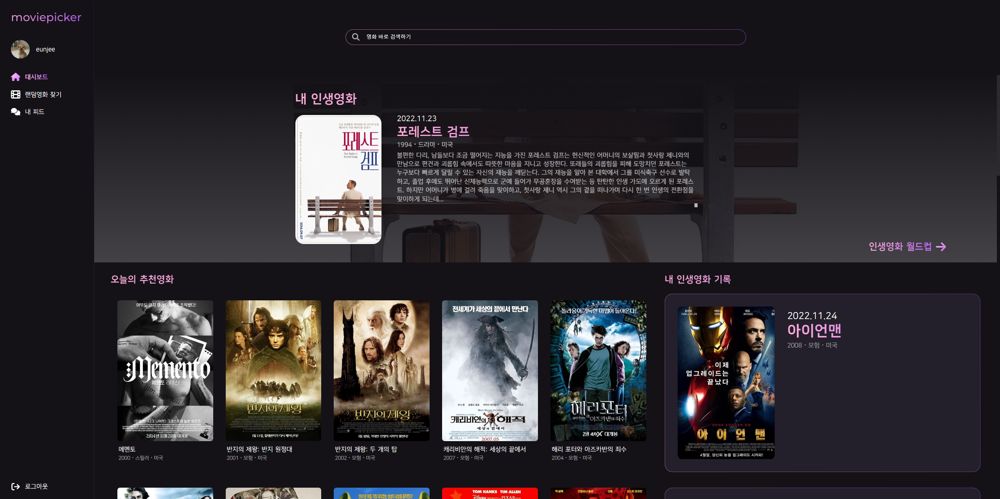

- 가장 최근에 등록된 인생영화가 메인 화면에 보여집니다.
- 내 인생영화를 기반으로 오늘의 추천영화 20개를 메인 화면에서 볼 수 있습니다.
- 추천 영화는 새로고침할 때마다 바뀝니다.
- 내 역대 인생영화 기록을 볼 수 있습니다.
- 검색바를 클릭하면 영화를 바로 검색할 수 있는 화면으로 이동합니다.


### 2) 영화 검색

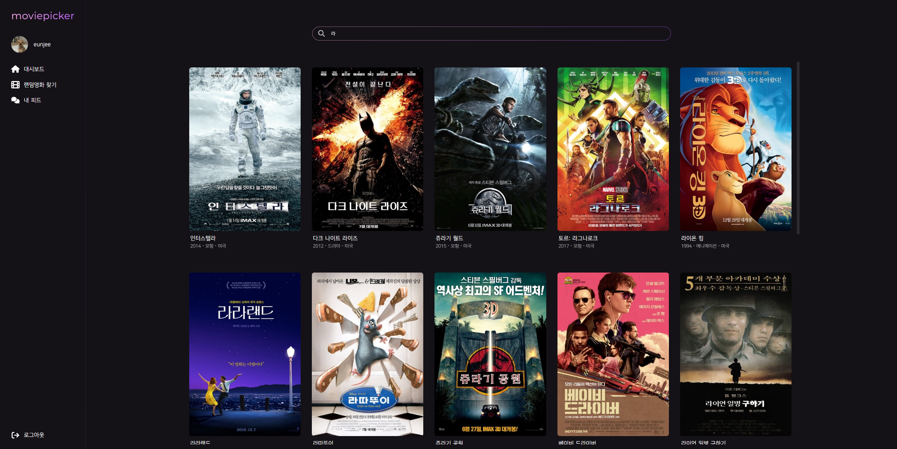

- 검색창의 input 이벤트가 발생할 때마다 검색 API를 DB에 요청하여 실시간으로 검색 결과가 보여지는 기능을 구현합니다.
- 영화포스터를 클릭하면 해당 영화의 디테일 페이지로 이동합니다.


### 3) 랜덤영화 찾기

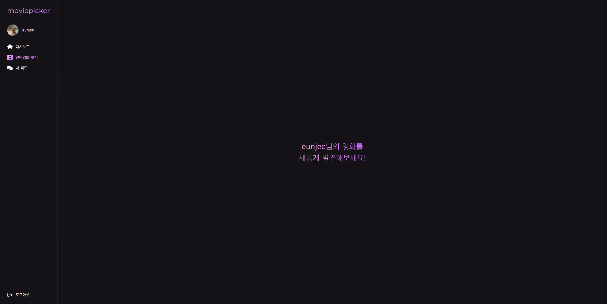

- 친근한 문구와 함께 랜덤영화 찾기 페이지로 이동합니다.

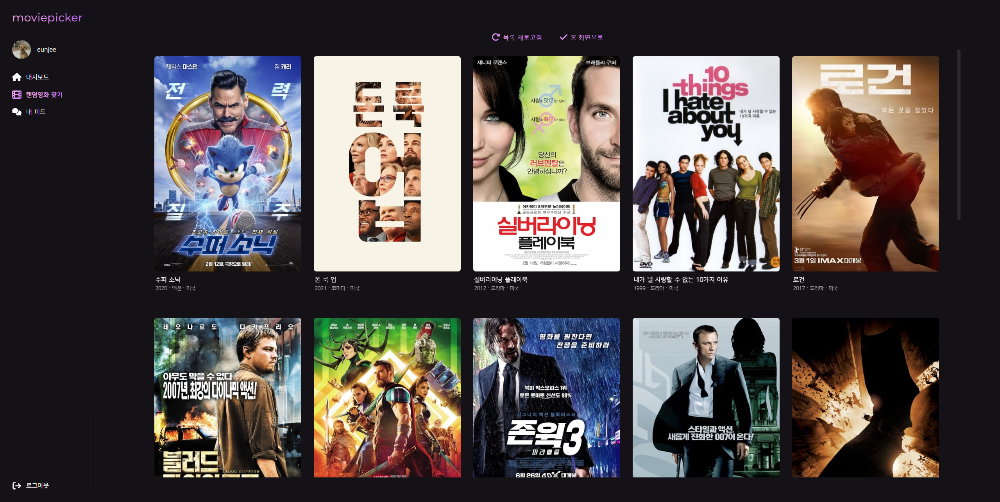

- 목록 새로고침을 누를 때마다 랜덤으로 영화가 주어집니다.
- 영화 포스터에 마우스를 올리면 '봤어요', '보고싶어요'에 바로 추가할 수 있는 버튼이 나타납니다.


### 4) 피드

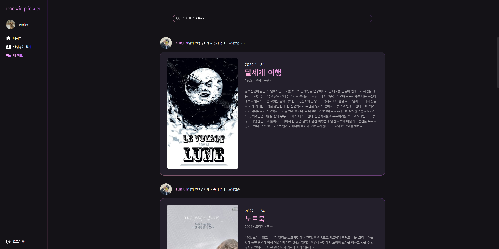

- 내가 팔로우한 유저들의 인생영화 업데이트 기록을 볼 수 있습니다.


### 5) 유저 디테일 페이지

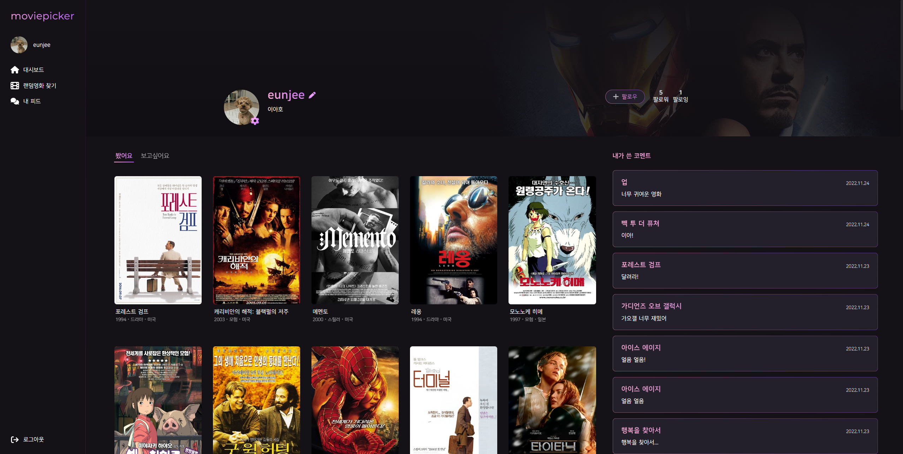

- 현재 로그인 하고 있는 유저의 디테일 페이지입니다. 내 프로필 사진과 상태메세지를 수정할 수 있는 버튼이 보여집니다.

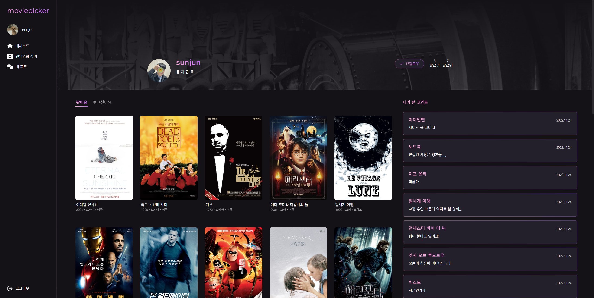

- 내가 아닌 유저 디테일 페이지에서는 팔로우 버튼이 보이고 프로필 사진 및 상태메세지를 수정하는 버튼은 보이지 않습니다.


### 6) 인생영화 월드컵

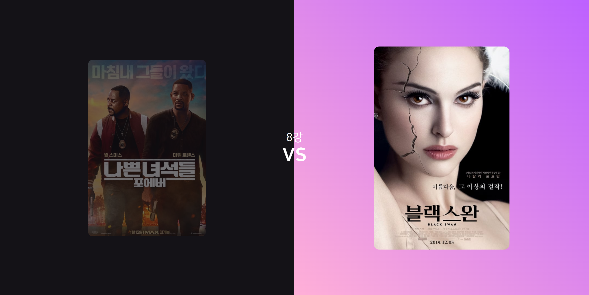

- 현재 몇강을 진행하고 있는지에 대한 정보가 화면에 보여집니다.
- 유저가 각 영화에 마우스를 올린 영화는 색상과 사이즈가 바뀝니다.

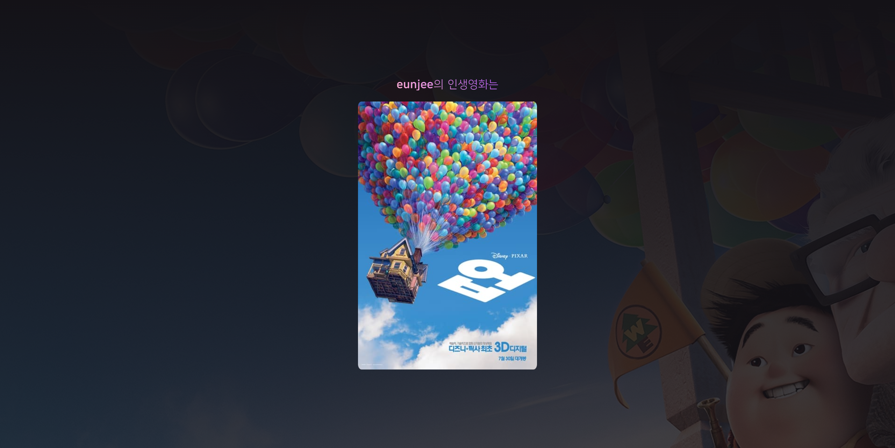

- 최총으로 우승하여 유저의 최신 인생영화를 보여주는 결과 화면입니다.
- 해당 화면이 보여진 이후 해당 영화에 대한 디테일 페이지로 이동합니다.


## 8. 배포 서버 URL

차후 기능 업데이트 및 UX 개선 후 진행할 예정입니다.


## 9. 기타 (느낀 점, 후기)

### 유선준

- 프론트와 백이 완전히 분리된 중-대규모의 서비스에서 django를 이용하여 백엔드를 온전히 구현할 수 있었습니다.
- 중-대규모 서비스에서 재사용성 및 협업을 고려한 코드 작성의 필요성과 방법에 대해 느끼고 배울 수 있었습니다.
- 실제 서비스 구현에서 javascript에서 비동기 처리가 어떻게 적용되고 UX에 영향을 미치는지 배울 수 있었습니다.
- 지난 수 개월 간 배운 내용들을 직접 적용하고, 부족한 부분은 찾아보면서 실제 내가 기획한 서비스를 하나씩 구현해 나가는 과정에서 많은 재미와 큰 보람을 느낄 수 있었습니다.


### 이은지

- 기획한 서비스를 직접 구현해나가며 초기에 서비스 설계 단계가 얼마나 중요한지 깨달았다. (컴포넌트 구조 및 API 설계 등의 측면에서)

- UI 디자인을 초기에 꼼꼼하게 만들어두면 실제 구현할 때 컴포넌트의 재사용 측면에서 훨씬 편하다.
- 프론트의 측면에서 실사용시 막힘이나 어색함 없이 흘러가는 UX를 구현하는 것이 서비스의 완성도를 높이는 데에 중요하다.
- Back-end와 연결하여 실제 데이터베이스를 가지고 구현하니 서비스가 살아움직이는 것 같은 느낌을 받았다. (희열을 느꼈다..)
- SCSS를 사용하니 CSS가 정말 편하고 재미있어졌다. CSS에 대해 다른 전처리기 언어나 프레임워크를 더 배워보고 싶다.
