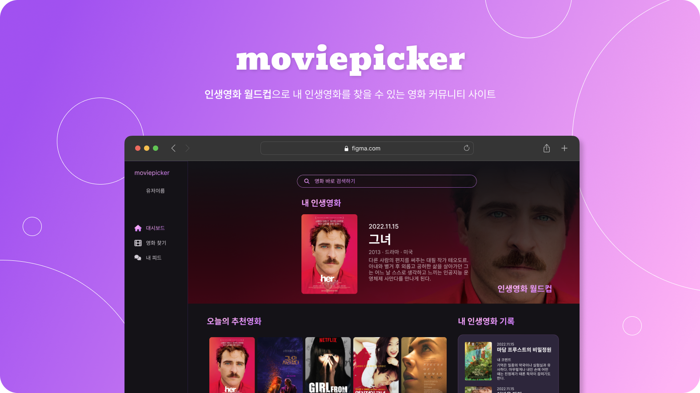

## 📋 프로젝트 개요

> **프로젝트명** : 무비피커   **개발 기간** : 2022년 11월 16일 ~ 2022년 11월 24일 (9일)   **분류** : 팀 프로젝트   **팀 구성** : 프론트엔드 1명, 백엔드 1명   **역할 및 기여도** : UI/UX 디자인 및 개발 100%  **사용 기술** : `Vue.js`, `Vuex`, `SCSS`, `JavaScript`, `Django`

 
 
 

## 🧑‍🤝‍🧑 팀 정보

| 이름   | 역할           | 설명                                          |
| ------ | -------------- | --------------------------------------------- |
| 유선준 | Back-end 전반  | 데이터베이스 설계 및 구축, 추천 알고리즘 구현 |
| 이은지 | Front-end 전반 | Vue를 활용한 SPA 구현, UI/UX 디자인           |

 
 
 

## 🔍 프로젝트 소개

#### 기획 배경
> 내가 본 수많은 영화들 중 내 인생영화를 효과적으로 고를 수 있는 방법이 없을까?

왓차에 수많은 영화들 중 **단 하나의 내 진짜 인생영화**는 무엇일까에 대한 궁금증에서 시작했습니다. 이를 통해 이상형 월드컵의 형식을 빌린 인생영화 월드컵 기능을 메인으로 하는 영화 커뮤니티 사이트를 만들게 됐습니다.

#### 핵심 기능

1. 사용자는 인생 영화 월드컵을 통해 인생영화를 갱신할 수 있으며 그에 따라 홈 화면이 구성됩니다.
2. 사용자가 영화를 자신의 '봤어요', '보고싶어요' 리스트에 저장할 수 있습니다.
3. 다른 사용자를 팔로우하고 팔로우한 사용자들의 인생영화 업데이트 기록을 피드에서 볼 수 있습니다.

 
 
 

## 👩🏻‍💻 기술 스택

- `JavaScript`
- `Vue.js`, `Vuex`
- `SCSS`

### `SCSS`

##### 기술 선택 이유

##### 사용하고 느낀 점

 
 
 

## 💡 주요 기능

> ✅ 표시는 직접 구현한 기능입니다.

1.  로그인 및 회원가입
    - ✅ 로그인
    - ✅ 회원가입
2.  홈화면

    - ✅ 가장 최근에 업데이트된 인생 영화가 메인 화면에 보여집니다.
    - ✅ 현재 내 인생영화를 기반으로 20개의 추천영화가 제공됩니다.
    - ✅ 새로고침시 추천영화가 새롭게 제공됩니다.

3.  랜덤 영화 찾기

    - ✅ 목록 새로 고침을 누르면 랜덤으로 새로운 영화 20개가 제공됩니다.
    - ✅ 사용자는 영화 아이템에 마우스를 올려 나타나는 버튼을 눌러 '봤어요' 혹은 '보고싶어요' 목록에 저장할 수 있습니다.

4.  영화 검색

    - ✅ 검색창의 input이 변할 때마다 실시간으로 검색 결과가 보여집니다.

5.  유저 디테일

    - ✅ 로그인한 사용자의 해당 사용자에 대한 팔로잉 여부에 따라 버튼이 다르게 보여집니다.
    - ✅ 사용자가 '팔로우' 버튼을 누르면 새로고침 없이 그 결과가 화면에 반영됩니다.

6.  피드

    - ✅ 내가 팔로우한 사용자들의 인생영화 업데이트 기록을 볼 수 있습니다.

7.  인생영화 월드컵

    - ✅ 총 몇 강의 인생영화 월드컵을 진행할 지 선택할 수 있습니다.
    - ✅ 게임을 진행하며 현재 몇 강인지에 대한 정보를 확인할 수 있습니다.
    - ✅ 최종 인생영화가 결정되면 해당 영화의 디테일 페이지로 이동합니다.
 
 
 

## 🌃 기능 상세 및 구현 화면

 
 
 

## 💭 프로젝트 회고

### 배운 점

### 아쉬운 점

 
 
 
 
 
 
 
 
 
 
